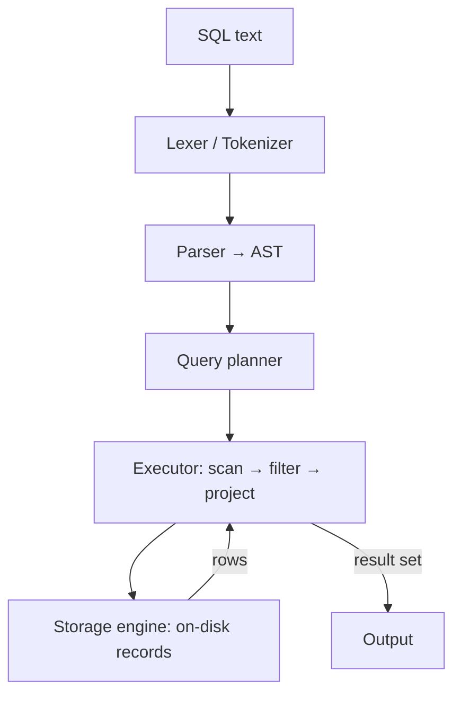

# AmaterasuSQL

A relational database engine built **from scratch in Java** — a SQL parser, a file-based storage engine, and a query executor with **predicate pushdown**.

AmaterasuSQL isn't meant to replace a production database. It's built to answer a simpler question: *what actually happens when you run `SELECT * FROM t WHERE x > 5`?* — by implementing each layer by hand instead of treating it as magic.

---

## Why I built it

Databases are the abstraction most of us lean on every day and understand least. The fastest way to stop treating one as a black box is to build a small (deliberately imperfect) one yourself — parser, storage, and execution — and feel where the real decisions and costs live.

## What it does

- **SQL parser** — tokenizes SQL text and parses it into an abstract syntax tree (AST) representing the query.
- **File-based storage engine** — a custom on-disk layout for how records are written and read back, with no external database underneath.
- **Query executor** — runs a query as a pipeline of operators (scan → filter → project), pulling rows up from storage.
- **Predicate pushdown** — filters are pushed down into the scan, so rows are skipped before they travel up the pipeline instead of being read and then thrown away.

## Architecture

The flow of a query, top to bottom:



The interesting work isn't the parser (the visible part) — it's the **storage layout**, which quietly sets the performance ceiling for every query, and **predicate pushdown**, which is the difference between reading a whole table and reading only what you need.

## Getting started

### Prerequisites
- Java 17+
- Gradle (or use the included `./gradlew` wrapper)

### Build
```bash
./gradlew build
```

### Run
```bash
./gradlew run
```

### Example

```sql
CREATE TABLE users (id INT, name TEXT, age INT);

INSERT INTO users VALUES (1, 'Aadesh', 25);
INSERT INTO users VALUES (2, 'Alex', 31);

SELECT id, name FROM users WHERE age > 26;
```

## Design notes

A few decisions worth calling out:

- **Storage first.** Record and page layout determine the cost of everything above them, so it got the most attention.
- **Execution as a pipeline.** Modeling the executor as composable operators makes the optimizer's job obvious: do less work, sooner.
- **Predicate pushdown.** A small idea with an outsized payoff, and the same instinct behind much of real query optimization.

## Roadmap

This is a learning project, not a production database. Natural next steps:

- [ ] Joins
- [ ] Indexes (B-tree)
- [ ] Transactions / durability (WAL)
- [ ] A wider SQL subset (aggregates, `GROUP BY`, `ORDER BY`)

## License

Released under the MIT License.

---

*The name is a nod to Amaterasu, the sun goddess — a bit of light thrown into database internals. Built by [Aadesh Wagh](https://aadeshwagh.com).*
